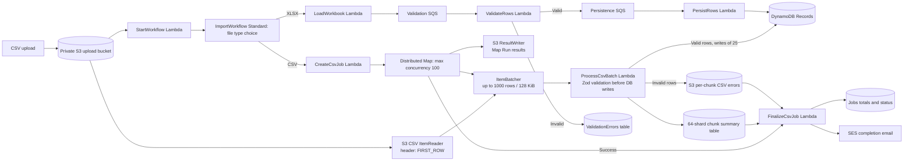

# Scaling CSV Imports to 5 Million Rows

## Status

The CDK stack now routes CSV uploads through an S3-backed Step Functions Distributed Map. This path is designed for CSV files with up to 5 million records, but has **not yet been load-tested at that volume**. Do not treat the target as a production throughput guarantee.

## Why the Current Loader Does Not Scale

The original [LoadWorkbook handler](lambda/handlers/load-workbook.ts) downloads the full S3 object into a `Buffer`, parses it into an ExcelJS workbook, creates an in-memory message for every data row, and sends SQS batches sequentially. That remains the `.xlsx` path and should only be used for supported workbook sizes. The scalable CSV path bypasses ExcelJS and reads CSV rows directly from S3 with a Distributed Map.

The XLSX loader is configured for 2 GB of memory and a 15-minute timeout. Increasing memory alone would not solve the unbounded arrays or sequential enqueueing for a multi-million-row CSV.

## Architecture

S3 remains the upload point and `StartWorkflow` remains the event entry point. `ImportWorkflow` branches on the object key:

- `.xlsx`: `LoadWorkbook` parses the workbook and uses the existing validation and persistence SQS path.
- `.csv`: `CreateCsvJob` initializes job metadata, then a Step Functions **Distributed Map** reads rows directly from S3 and invokes `ProcessCsvBatch` with bounded batches.

The Map Run does not create one child execution per CSV row. `ItemBatcher` groups rows, and each Express child invokes the worker once per batch. With 1,000 rows per batch, 5 million rows require about 5,000 child executions; the 128 KiB byte cap can create smaller batches for larger rows.

## Processing Design

1. **Upload:** Put the CSV in the private upload bucket. Its first row must contain `name,email,contact number,address`. The object is processed as one job.
2. **Select the path:** `StartWorkflow` starts a Standard execution with the bucket, key, and job ID. `ImportWorkflow` selects the CSV branch by `.csv` key suffix; XLSX files continue through the existing loader.
3. **Initialize:** `CreateCsvJob` idempotently creates the `Jobs` item with status `PROCESSING` and the source key. Total rows are counted from completed chunk summaries after the Map Run.
4. **Read and batch:** `S3CsvItemReader` reads the object with `CSVHeaderLocation: FIRST_ROW`. The source bucket and state machine must be in the same account and Region. `ItemBatcher` is configured for at most 1,000 rows and 128 KiB per child input.
5. **Validate before database writes:** `ProcessCsvBatch` maps the exact `contact number` CSV header to `contactNumber` and runs the shared Zod schema for every row in the batch before writing any valid rows to `Records`.
6. **Apply validation rules:** `name` and `address` must be non-empty after trimming; `email` must be a valid email string; `contact number` is stored as text, may contain a leading `+`, digits, spaces, parentheses, periods, or hyphens, and must contain 7 to 15 digits. Adjust this policy in `lambda/lib/record-schema.ts` if business rules differ.
7. **Write valid records:** Valid rows are written to DynamoDB `Records` in `BatchWriteItem` groups of up to 25. Unprocessed writes are retried with exponential backoff. The row key is deterministic (`jobId`, `rowNumber`) so a retried chunk overwrites the same values rather than double-counting rows.
8. **Keep invalid rows out of `Records`:** Invalid rows are written as deterministic CSV parts under `reports/{jobId}/errors/`. Each part includes `rowNumber`, the four input fields, and Zod issue messages. The email links to a manifest of part keys; recipients need AWS access to download those private parts.
9. **Record chunk results:** After the S3 error part and valid DynamoDB writes succeed, the worker conditionally stores one summary in `CsvChunkSummaries`. The summary key is sharded across 64 job partitions and contains total, valid, invalid counts, and the optional error-part key. Retries first check for this summary and do not count the chunk twice.
10. **Control load and retries:** Distributed Map concurrency is capped at 100; each child uses an EXPRESS workflow. The worker Lambda has a four-minute timeout, the state machine has a six-hour timeout, and the worker task retries task failures/timeouts up to three times. These are starting controls, not proven throughput targets.
11. **Finalize:** After the Map Run succeeds, `FinalizeCsvJob` queries the 64 chunk-summary shards, aggregates totals, writes an error manifest when needed, emails the result, and updates `Jobs` to `COMPLETE`. The ResultWriter stores Map Run results in S3 rather than returning all child results to the parent state.

## AWS Limits to Design Around

These are service limits, not recommended operating targets. Recheck them in the deployment Region before production use.

| Limit                                                                                         | Design impact                                                                                                                                                                                        |
| --------------------------------------------------------------------------------------------- | ---------------------------------------------------------------------------------------------------------------------------------------------------------------------------------------------------- |
| Distributed Map can read up to 100 million items.                                             | 5 million data rows are within the documented item count; confirm row parsing and header handling with representative files.                                                                         |
| A single S3 object read by the Distributed Map ItemReader can be at most 10 GB.               | If the CSV is larger, split it into smaller valid CSV objects and process the object prefix with an S3 object ItemReader using `LOAD_AND_FLATTEN`, or preprocess it with a distributed data service. |
| Each Step Functions task/state input or output is limited to 256 KiB.                         | Keep each batched worker input and worker output below this limit; use the ItemBatcher byte cap.                                                                                                     |
| Distributed Map allows at most 10,000 concurrent child executions.                            | This is a hard ceiling, not a safe concurrency setting. Downstream capacity is usually the actual constraint.                                                                                        |
| A standard Lambda invocation can run for at most 15 minutes and use at most 10,240 MB memory. | This worker is configured for four minutes and 2 GB, and handles a bounded batch rather than scanning the full 5-million-row file.                                                                   |

CSV rows can include quoted commas/newlines and larger-than-expected fields. Test the exact CSV dialect and representative maximum row size. A single row must fit the selected worker input budget after Step Functions parses and batches it.

## Storage, Cost, and Throughput

- Persisting 5 million valid rows as individual DynamoDB items still means 5 million writes, plus summary/error writes. Estimate storage and request costs before deployment; on-demand billing does not remove the cost of that volume.
- If the application does not need point-lookups by row, consider writing validated results as partitioned files in S3 instead of one DynamoDB item per row. Queryable analytics can use a columnar format such as Parquet with a service such as AWS Glue/Athena.
- Load-test with representative files at increasing sizes (for example, 100,000, 1 million, then 5 million rows) before production use. Measure duration, Lambda concurrency/throttles, DynamoDB throttling, S3 output volume, Map Run failures, and cost. This implementation has not yet been tested at 5 million rows.
- Set alarms for failed/timed-out child executions, Lambda errors/throttles, DynamoDB throttles, and incomplete jobs. Preserve enough per-chunk metadata to retry failures without reprocessing successful chunks.

## Current Implementation and Remaining Work

The CSV branch, Zod validation, chunk summaries, part files, finalizer, and ResultWriter are implemented. Remaining before production use:

- Load-test the full 5-million-row path; no benchmark or production claim is implied by the configured limits.
- Confirm the CSV object is no larger than Step Functions' 10 GB ItemReader limit. The current implementation does not split oversized inputs into multiple objects.
- Review DynamoDB cost and decide whether 5 million individual `Records` items are required or whether validated output should instead be partitioned in S3.
- Define monitoring/alarms and a retry/recovery procedure for failed Map Runs and dead-letter queues.
- The `.xlsx` path still buffers the entire workbook through ExcelJS and is not covered by the multi-million-row CSV design.

## References

- [Step Functions Distributed Map](https://docs.aws.amazon.com/step-functions/latest/dg/state-map-distributed.html)
- [Step Functions ItemReader, including S3 CSV input](https://docs.aws.amazon.com/step-functions/latest/dg/input-output-itemreader.html)
- [Step Functions ItemBatcher](https://docs.aws.amazon.com/step-functions/latest/dg/input-output-itembatcher.html)
- [Step Functions ResultWriter](https://docs.aws.amazon.com/step-functions/latest/dg/input-output-resultwriter.html)
- [Step Functions service quotas](https://docs.aws.amazon.com/step-functions/latest/dg/service-quotas.html)
- [AWS Lambda quotas](https://docs.aws.amazon.com/lambda/latest/dg/gettingstarted-limits.html)
- [Zod documentation](https://zod.dev/)
