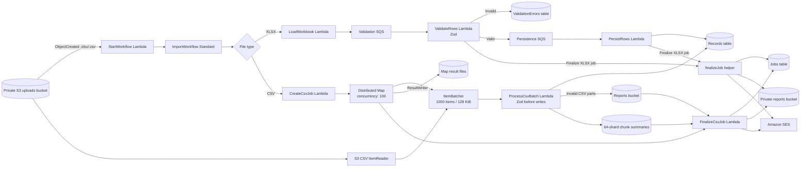

# Lambda Pipeline Architecture

This document explains how the asynchronous AWS import pipeline is implemented. Infrastructure is declared in [pipeline-stack.ts](lib/pipeline-stack.ts), Lambda entry points are in `lambda/handlers/`, and shared Lambda logic is in `lambda/lib/`.

The Express service under `src/` is a separate local API. It is not the S3-triggered Lambda pipeline described below.

## Architecture Map

`.xlsx` validation and persistence are SQS-triggered and continue asynchronously after the Step Functions loader task succeeds. CSV processing runs inside the Distributed Map and finalizes only after its child batches succeed.

## Processing Stages

1. **Upload event:** The upload bucket sends `.xlsx` and `.csv` object-created notifications to `StartWorkflow`.
2. **Start execution:** `StartWorkflow` decodes the S3 key and starts an execution with `bucket`, `key`, and `jobId`.
3. **Choose path:** `ImportWorkflow` uses the key suffix. XLSX uses `LoadWorkbook`; CSV uses `CreateCsvJob`, then an S3 CSV ItemReader in a Distributed Map.
4. **Process XLSX:** `LoadWorkbook` creates the job and sends rows to `ValidationQueue`. `ValidateRows` validates with Zod; invalid rows are stored in `ValidationErrors`, and valid rows go to `PersistenceQueue`. `PersistRows` writes them to `Records`.
5. **Process CSV:** `ItemBatcher` groups at most 1,000 records and 128 KiB of input. `ProcessCsvBatch` validates every row with the shared Zod schema before writing any valid records. Valid rows are written to `Records`; invalid rows are written to per-chunk CSV objects in S3.
6. **Track and finalize CSV:** The worker writes an idempotent summary into one of 64 `CsvChunkSummaries` partitions. After the Map Run succeeds, `FinalizeCsvJob` aggregates the summaries, updates `Jobs`, writes an error manifest if needed, and emails a presigned manifest link.
7. **Finalize XLSX:** `finalizeJob` runs after each SQS row is recorded. Once all rows are accounted for, it writes an optional error CSV, emails the result, and marks the job complete.

## Lambda and Helper Responsibilities

### `StartWorkflow`

Source: [start-workflow.ts](lambda/handlers/start-workflow.ts)

- Trigger: S3 object-created notification.
- Input: S3 event records.
- Action: for every record, URL-decodes the key and calls Step Functions `StartExecution`.
- Execution input: `{ "bucket": "...", "key": "...", "jobId": "..." }`.
- Output: none. The `jobId` in the execution input is separate from the random execution name.

### `LoadWorkbook`

Source: [load-workbook.ts](lambda/handlers/load-workbook.ts)

- Trigger: `CreateBatches` task in `ImportWorkflow`.
- Input: bucket, key, and job ID from the execution input.
- In the deployed workflow, this Lambda handles `.xlsx` files. It reads the entire S3 object into memory and uses the first worksheet.
- Header values are trimmed and lowercased; row values are read from `name`, `email`, `contact number`, and `address` columns.
- Missing columns become empty strings and are handled as validation errors later. The loader does not reject a missing header by itself.
- Creates a `Jobs` item with status `PROCESSING`, total row count, zeroed counters, source key, and creation time.
- Sends each data row to `ValidationQueue` in batches of up to 10.
- Returns `{ jobId, totalRows }` to Step Functions.

The workbook is fully buffered in Lambda memory. The loader has a 15-minute timeout and 2048 MB memory allocation; it is not the large-CSV path.

### `CreateCsvJob`

Source: [create-csv-job.ts](lambda/handlers/create-csv-job.ts)

- Trigger: CSV branch in `ImportWorkflow`.
- Idempotently creates the initial `Jobs` item with status `PROCESSING` and the source key.
- The total/valid/invalid row counts are filled in by `FinalizeCsvJob` after all chunks finish.

### `ProcessCsvBatch`

Source: [process-csv-batch.ts](lambda/handlers/process-csv-batch.ts)

- Trigger: each Distributed Map Express child execution; each input contains a bounded `Items` array.
- Normalizes CSV header names and maps `contact number` to the internal `contactNumber` field.
- Uses [record-schema.ts](lambda/lib/record-schema.ts) and Zod `safeParse` on the entire batch before writing valid rows to DynamoDB.
- Valid rows are written to `Records` in groups of up to 25. DynamoDB unprocessed writes are retried with exponential backoff.
- Invalid rows are written to a deterministic per-chunk CSV in the reports bucket and never written to `Records`.
- Stores one conditional chunk summary across 64 job shards. Retried batches reuse the summary and deterministic row keys so counts are not incremented twice.
- Returns a small count summary, not the rows themselves.

The CSV path is configured for concurrency 100, 1,000 rows and 128 KiB per batch, a four-minute worker timeout, and a six-hour parent execution timeout. These settings are starting limits; the 5-million-row target has not yet been load-tested.

### `ValidateRows`

Source: [validate-row.ts](lambda/handlers/validate-row.ts)

- Trigger: messages from `ValidationQueue`, with an event-source batch size of 10.
- Validates `name`, `email`, `contactNumber`, and `address` with the shared Zod schema before forwarding a valid row.
- Invalid rows: transactionally writes the row and its errors to `ValidationErrors`, then increments `completedRows` and `invalidRows` in `Jobs`.
- Valid rows: forwards the original message body to `PersistenceQueue`. It does not mark a valid row complete; `PersistRows` does that after storage.
- Invalid rows in this XLSX/SQS path are written to `ValidationErrors` and counted as complete.
- Calls `finalizeJob` after successfully recording an invalid row.
- Returns SQS partial batch failures so only failed messages need to be retried.

### `PersistRows`

Source: [persist-row.ts](lambda/handlers/persist-row.ts)

- Trigger: messages from `PersistenceQueue`, with an event-source batch size of 10.
- Transactionally writes the row to `Records` and increments `completedRows` and `validRows` in `Jobs`.
- Calls `finalizeJob` after a successful write or when it confirms that the row was already stored.
- Returns SQS partial batch failures for retry handling.

### `finalizeJob`

Source: [finalize-job.ts](lambda/lib/finalize-job.ts)

This shared helper is imported by both SQS handlers; it is not a separate Lambda. It:

1. Reads the job consistently from DynamoDB and returns unless `completedRows === totalRows` and status is `PROCESSING`.
2. Uses a conditional update to claim finalization by changing status to `FINALIZING`; this prevents concurrent row handlers from finalizing the same job at once.
3. Reads all validation errors. If any exist, writes a CSV to the reports bucket, including contact number, and creates a presigned download URL that expires after seven days.
4. Sends a completion email through SES with valid/invalid counts and the optional report link.
5. Sets the job to `COMPLETE` with a finish timestamp.

If finalization fails, it attempts to reset status to `PROCESSING` and rethrows the error so the invoking SQS record can be retried.

### `FinalizeCsvJob`

Source: [finalize-csv-job.ts](lambda/handlers/finalize-csv-job.ts)

- Trigger: the final state after the CSV Distributed Map succeeds.
- Queries the 64 `CsvChunkSummaries` shards and aggregates total, valid, and invalid rows.
- Writes a manifest listing the per-chunk error CSV object keys, signs the manifest URL for seven days, emails counts and the link, then marks the job `COMPLETE`.
- CSV error parts remain private. Downloading the listed parts requires AWS access to the reports bucket.

## Data Model and Status

| Resource                           | Key                                                                    | Purpose                                                                              |
| ---------------------------------- | ---------------------------------------------------------------------- | ------------------------------------------------------------------------------------ |
| `Jobs` DynamoDB table              | `jobId`                                                                | Job status, source object, row totals, counters, and timestamps.                     |
| `Records` DynamoDB table           | `jobId` partition key, `rowNumber` sort key                            | Successfully validated rows.                                                         |
| `ValidationErrors` DynamoDB table  | `jobId` partition key, `rowNumber` sort key                            | Invalid rows and their validation messages.                                          |
| `CsvChunkSummaries` DynamoDB table | `jobShard` partition key, `chunkId` sort key                           | Idempotent totals and error-part keys for CSV batches, spread across 64 shards.      |
| `ValidationQueue` SQS queue        | SQS message ID                                                         | Row messages waiting for validation.                                                 |
| `PersistenceQueue` SQS queue       | SQS message ID                                                         | Valid row messages waiting for persistence.                                          |
| Uploads S3 bucket                  | Object key                                                             | Source `.xlsx` and `.csv` files; private, encrypted, and retained on stack deletion. |
| Reports S3 bucket                  | `reports/{jobId}-errors.csv` or `reports/{jobId}/errors/{chunkId}.csv` | Private XLSX reports and CSV error parts; retained on stack deletion.                |

Job status normally moves from `PROCESSING` to `FINALIZING` to `COMPLETE`. If finalization throws, the helper attempts to move it back to `PROCESSING`.

## Retries and Failure Handling

- The state machine has a six-hour timeout. XLSX loader tasks retry service exceptions. CSV batch tasks retry task failures/timeouts up to three times, with idempotent writes and summaries.
- Both SQS event sources use batches of 10 and partial batch responses. A handler reports failed message IDs so successfully handled messages in the same batch are not retried unnecessarily.
- Each queue has a three-minute visibility timeout and a dead-letter queue configured after five receives. Inspect the DLQs for messages that continue to fail.
- DynamoDB transactions and conditional writes avoid incrementing counts again when a previously stored row is encountered during SQS retry.
- A failure to load a workbook, create the job, or enqueue rows fails the state machine task. Inspect the `LoadWorkbook` Lambda logs and the Step Functions execution details.
- A state machine success means the loader completed and queued rows. It does not prove the SQS consumers finished; check the job counters and status separately.

## Environment and Permissions

The CDK stack sets Lambda environment variables from resources it creates. Do not manually substitute the placeholder values from `.env.example` into the deployed functions.

| Function          | Environment values supplied by CDK                                                                          | Main access granted by CDK                                             |
| ----------------- | ----------------------------------------------------------------------------------------------------------- | ---------------------------------------------------------------------- |
| `StartWorkflow`   | `STATE_MACHINE_ARN`                                                                                         | Start executions of `ImportWorkflow`.                                  |
| `LoadWorkbook`    | `JOBS_TABLE`, `VALIDATION_QUEUE_URL`, `UPLOADS_BUCKET`                                                      | Read upload objects, write job records, send validation messages.      |
| `CreateCsvJob`    | `JOBS_TABLE`                                                                                                | Initialize the CSV job.                                                |
| `ProcessCsvBatch` | `CHUNK_SUMMARIES_TABLE`, `RECORDS_TABLE`, `REPORTS_BUCKET`                                                  | Write valid rows, chunk summaries, and error CSV parts.                |
| `FinalizeCsvJob`  | `JOBS_TABLE`, `CHUNK_SUMMARIES_TABLE`, `REPORTS_BUCKET`, `NOTIFICATION_EMAIL`, `SES_FROM_EMAIL`             | Aggregate CSV summaries, write/sign error manifest, send SES email.    |
| `ValidateRows`    | `JOBS_TABLE`, `ERRORS_TABLE`, `REPORTS_BUCKET`, `NOTIFICATION_EMAIL`, `SES_FROM_EMAIL`, `RECORDS_QUEUE_URL` | Validate XLSX rows, write errors, send persistence messages, finalize. |
| `PersistRows`     | `JOBS_TABLE`, `ERRORS_TABLE`, `REPORTS_BUCKET`, `NOTIFICATION_EMAIL`, `SES_FROM_EMAIL`, `RECORDS_TABLE`     | Persist XLSX rows and finalize.                                        |

The project also runs a separate Express API from `src/server.ts`. Its `PORT`, `CORS_ORIGIN`, and `UPLOADS_BUCKET` values configure that local service, not the deployed Lambda environment.

## Deployment and Monitoring

For account setup, credentials, SES verification, CDK bootstrap, and deploy commands, follow [AWS_DEPLOYMENT.md](docs/AWS_DEPLOYMENT.md). For Step Functions-specific execution monitoring, see [STEP_FUNCTIONS.md](docs/STEP_FUNCTIONS.md).

Useful places to inspect a job:

- Step Functions console: loader task input, result, and execution failure.
- CloudWatch Logs: `StartWorkflow`, `LoadWorkbook`, `ValidateRows`, and `PersistRows` logs.
- SQS console: queue depth and dead-letter messages.
- DynamoDB console: job counters/status, persisted rows, and validation errors.
- SES: delivery state and account sending/sandbox restrictions.
