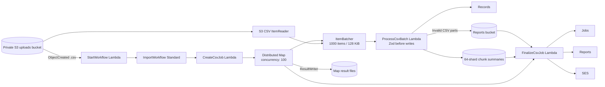

# Lambda Pipeline Architecture

This document explains how the asynchronous AWS import pipeline is implemented. Infrastructure is declared in [pipeline-stack.ts](lib/pipeline-stack.ts), Lambda entry points are in `lambda/handlers/`, and shared Lambda logic is in `lambda/lib/`.

The Express service under `src/` is a separate local API. It is not the S3-triggered Lambda pipeline described below.

## Architecture Map

Only lowercase `.csv` objects start the workflow. CSV processing runs inside the Distributed Map and finalizes after its child batches succeed.

## Processing Stages

1. **Upload event:** The upload bucket sends `.csv` object-created notifications to `StartWorkflow`.
2. **Start execution:** `StartWorkflow` decodes the S3 key and starts an execution with `bucket`, `key`, and `jobId`.
3. **Initialize job:** `CreateCsvJob` creates the initial job record.
4. **Process CSV:** `ItemBatcher` groups at most 1,000 records and 128 KiB of input. `ProcessCsvBatch` validates every row with the shared Zod schema before writing any valid records. Valid rows are written to `Records`; invalid rows are written to per-chunk CSV objects in S3.
5. **Track and finalize:** The worker writes an idempotent summary into one of 64 `CsvChunkSummaries` partitions. After the Map Run succeeds, `FinalizeCsvJob` aggregates the summaries, updates `Jobs`, writes an error manifest if needed, and emails a presigned manifest link.

## Lambda and Helper Responsibilities

### `StartWorkflow`

Source: [start-workflow.ts](lambda/handlers/start-workflow.ts)

- Trigger: S3 object-created notification.
- Input: S3 event records.
- Action: for every record, URL-decodes the key and calls Step Functions `StartExecution`.
- Execution input: `{ "bucket": "...", "key": "...", "jobId": "..." }`.
- Output: none. The `jobId` in the execution input is separate from the random execution name.

### `CreateCsvJob`

Source: [create-csv-job.ts](lambda/handlers/create-csv-job.ts)

- Trigger: first task in `ImportWorkflow`.
- Idempotently creates the initial `Jobs` item with status `PROCESSING` and the source key.
- The total/valid/invalid row counts are filled in by `FinalizeCsvJob` after all chunks finish.

### `ProcessCsvBatch`

Source: [process-csv-batch.ts](lambda/handlers/process-csv-batch.ts)

- Trigger: each Distributed Map Express child execution; each input contains a bounded `Items` array.
- Normalizes CSV header names and maps `contact number` to the internal `contactNumber` field.
- Uses [record-schema.ts](lambda/lib/record-schema.ts) and Zod `safeParse` on the entire batch before writing valid rows to DynamoDB.
- Valid rows are written to `Records` in groups of up to 25. DynamoDB unprocessed writes are retried with exponential backoff.
- Invalid rows are written to a deterministic per-chunk CSV in the reports bucket and never written to `Records`.
- Stores one conditional chunk summary across 64 job shards. Retried batches reuse the summary and deterministic row keys so counts are not incremented twice.
- Returns a small count summary, not the rows themselves.

The CSV path is configured for concurrency 100, 1,000 rows and 128 KiB per batch, a four-minute worker timeout, and a six-hour parent execution timeout. These settings are starting limits; the 5-million-row target has not yet been load-tested.

### `FinalizeCsvJob`

Source: [finalize-csv-job.ts](lambda/handlers/finalize-csv-job.ts)

- Trigger: the final state after the CSV Distributed Map succeeds.
- Queries the 64 `CsvChunkSummaries` shards and aggregates total, valid, and invalid rows.
- Writes a manifest listing the per-chunk error CSV object keys, signs the manifest URL for seven days, emails counts and the link, then marks the job `COMPLETE`.
- CSV error parts remain private. Downloading the listed parts requires AWS access to the reports bucket.

## Data Model and Status

| Resource                           | Key                                          | Purpose                                                                         |
| ---------------------------------- | -------------------------------------------- | ------------------------------------------------------------------------------- |
| `Jobs` DynamoDB table              | `jobId`                                      | Job status, source object, row totals, counters, and timestamps.                |
| `Records` DynamoDB table           | `jobId` partition key, `rowNumber` sort key  | Successfully validated rows.                                                    |
| `CsvChunkSummaries` DynamoDB table | `jobShard` partition key, `chunkId` sort key | Idempotent totals and error-part keys for CSV batches, spread across 64 shards. |
| Uploads S3 bucket                  | Object key                                   | Source `.csv` files; private, encrypted, and retained on stack deletion.        |
| Reports S3 bucket                  | `reports/{jobId}/errors/{chunkId}.csv`       | Private CSV error parts and manifests; retained on stack deletion.              |

Job status normally moves from `PROCESSING` to `FINALIZING` to `COMPLETE`. If finalization throws, `FinalizeCsvJob` attempts to move it back to `PROCESSING`.

## Retries and Failure Handling

- The state machine has a six-hour timeout. CSV batch tasks retry task failures/timeouts up to three times, with idempotent writes and summaries.
- A failed job initialization, CSV batch, or finalization task fails the state machine execution. Inspect the Step Functions execution details and relevant Lambda logs.
- A successful execution includes the Map Run and finalization. Check the job status and counts for the completed import.

## Environment and Permissions

The CDK stack sets Lambda environment variables from resources it creates. Do not manually substitute the placeholder values from `.env.example` into the deployed functions.

| Function          | Environment values supplied by CDK                                                              | Main access granted by CDK                                      |
| ----------------- | ----------------------------------------------------------------------------------------------- | --------------------------------------------------------------- |
| `StartWorkflow`   | `STATE_MACHINE_ARN`                                                                             | Start executions of `ImportWorkflow`.                           |
| `CreateCsvJob`    | `JOBS_TABLE`                                                                                    | Initialize the CSV job.                                         |
| `ProcessCsvBatch` | `CHUNK_SUMMARIES_TABLE`, `RECORDS_TABLE`, `REPORTS_BUCKET`                                      | Write valid rows, chunk summaries, and error CSV parts.         |
| `FinalizeCsvJob`  | `JOBS_TABLE`, `CHUNK_SUMMARIES_TABLE`, `REPORTS_BUCKET`, `NOTIFICATION_EMAIL`, `SES_FROM_EMAIL` | Aggregate summaries, write/sign error manifest, send SES email. |

The project also runs a separate Express API from `src/server.ts`. Its `PORT`, `CORS_ORIGIN`, and `UPLOADS_BUCKET` values configure that local service, not the deployed Lambda environment.

## Deployment and Monitoring

For account setup, credentials, SES verification, CDK bootstrap, and deploy commands, follow [AWS_DEPLOYMENT.md](docs/AWS_DEPLOYMENT.md). For Step Functions-specific execution monitoring, see [STEP_FUNCTIONS.md](docs/STEP_FUNCTIONS.md).

Useful places to inspect a job:

- Step Functions console: execution and Map Run results or failures.
- CloudWatch Logs: `StartWorkflow`, `ProcessCsvBatch`, and `FinalizeCsvJob` logs.
- DynamoDB console: job counters/status and persisted rows.
- SES: delivery state and account sending/sandbox restrictions.
