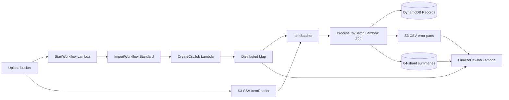

# Step Functions Workflow

This guide describes the asynchronous import workflow deployed by the `ExcelImportPipeline` CDK stack.

## Workflow

An S3 object-created event for a lowercase `.csv` object invokes `StartWorkflow`. That handler starts one state machine execution per S3 record, passing the bucket, decoded object key, and a generated job ID. `ImportWorkflow` initializes the job and processes CSV rows with the Distributed Map path described in [LARGE_CSV_SCALING.md](LARGE_CSV_SCALING.md). Other file types do not start an execution.

```json
{
  "bucket": "uploads-bucket-name",
  "key": "uploads/example.csv",
  "jobId": "generated-job-id"
}
```

`ImportWorkflow` initializes the CSV job and starts an S3 CSV ItemReader in a Distributed Map. The Map batches rows for `ProcessCsvBatch`; after the Map succeeds, `FinalizeCsvJob` aggregates chunk summaries.



The state machine timeout is six hours. Map concurrency is capped at 100; batches are capped at 1,000 rows or 128 KiB, and the worker has a four-minute timeout. The 5-million-row CSV target has not been load-tested.

## Deploy

Prerequisites: Node.js 22, AWS credentials, a bootstrapped CDK account and region, and verified SES sender and recipient addresses.

```sh
npm install
npm run build
npx cdk bootstrap aws://ACCOUNT_ID/REGION
npx cdk deploy --parameters ExcelImportPipeline:NotificationEmail=recipient@example.com --parameters ExcelImportPipeline:SesFromEmail=verified-sender@example.com
```

Use the stack outputs to find the upload bucket and state machine ARN. The stack injects the table, bucket, and state machine settings into the Lambda functions; they do not need to be configured manually for the deployed workflow.

## Run an Import

Upload a lowercase `.csv` file to the deployed upload bucket. Other file types do not start an execution. The header row must contain `name`, `email`, `contact number`, and `address`. Zod validates non-empty name/address, email format, and international contact number text with 7-15 digits before valid rows reach `Records`. For the browser flow, request a presigned URL from `POST /uploads/presign`, then `PUT` the CSV bytes to the returned URL with the returned `Content-Type` header.

## Monitor and Troubleshoot

- In the Step Functions console, open the state machine identified by the stack output and inspect execution input, task output, and failure details.
- If no execution starts, inspect the `StartWorkflow` Lambda logs and confirm the uploaded object key ends in lowercase `.csv`.
- If the CSV Map fails, inspect Map Run failures and `ProcessCsvBatch` logs. Check chunk summaries for idempotent progress and inspect Map ResultWriter objects for execution outputs.
- After an execution succeeds, inspect `Jobs` and follow the error manifest in email to access private per-chunk CSVs.
