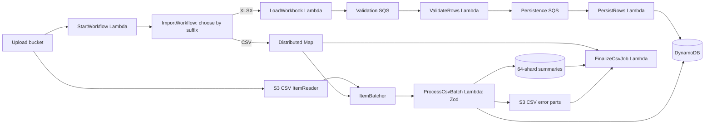

# Step Functions Workflow

This guide describes the asynchronous import workflow deployed by the `ExcelImportPipeline` CDK stack.

## Workflow

An S3 object-created event for a `.xlsx` or `.csv` object invokes `StartWorkflow`. That handler starts one state machine execution per S3 record, passing the bucket, decoded object key, and a generated job ID. `ImportWorkflow` routes by suffix: XLSX uses the workbook loader; CSV uses the Distributed Map path described in [LARGE_CSV_SCALING.md](../LARGE_CSV_SCALING.md).

```json
{
  "bucket": "uploads-bucket-name",
  "key": "uploads/example.csv",
  "jobId": "generated-job-id"
}
```

For `.xlsx`, `ImportWorkflow` invokes `LoadWorkbook`, which reads the first worksheet, creates a job record, and sends row messages to `ValidationQueue` in batches of up to 10. For `.csv`, it initializes the job and starts an S3 CSV ItemReader in a Distributed Map. The Map batches rows for `ProcessCsvBatch`; after the Map succeeds, `FinalizeCsvJob` aggregates chunk summaries.



The XLSX validation and persistence Lambdas are SQS consumers and run asynchronously. A successful XLSX Step Functions execution means the loader completed and queued rows, not that SQS processing finished. For CSV, the Distributed Map performs batch processing before its parent execution succeeds.

The parent state machine timeout is six hours. CSV Map concurrency is capped at 100; batches are capped at 1,000 rows or 128 KiB, and the worker has a four-minute timeout. The XLSX loader can run for up to 15 minutes. The 5-million-row CSV target has not been load-tested.

## Deploy

Prerequisites: Node.js 22, AWS credentials, a bootstrapped CDK account and region, and verified SES sender and recipient addresses.

```sh
npm install
npm run build
npx cdk bootstrap aws://ACCOUNT_ID/REGION
npx cdk deploy --parameters ExcelImportPipeline:NotificationEmail=recipient@example.com --parameters ExcelImportPipeline:SesFromEmail=verified-sender@example.com
```

Use the stack outputs to find the upload bucket and state machine ARN. The stack injects the table, queue, bucket, and state machine settings into the Lambda functions; they do not need to be configured manually for the deployed workflow.

## Run an Import

Upload an `.xlsx` or `.csv` file to the deployed upload bucket. The header row must contain `name`, `email`, `contact number`, and `address`. Zod validates non-empty name/address, email format, and international contact number text with 7-15 digits before valid rows reach `Records`. For the browser CSV flow, request a presigned URL from `POST /uploads/presign`, then `PUT` the CSV bytes to the returned URL with the returned `Content-Type` header.

## Monitor and Troubleshoot

- In the Step Functions console, open the state machine identified by the stack output and inspect execution input, task output, and failure details.
- If no execution starts, inspect the `StartWorkflow` Lambda logs and confirm the uploaded object key ends in `.xlsx` or `.csv`.
- If XLSX fails in `CreateBatches`, inspect the `LoadWorkbook` Lambda logs. The loader rejects objects with no body, workbooks with no worksheets, and sheets with no data rows.
- If the CSV Map fails, inspect Map Run failures and `ProcessCsvBatch` logs. Check chunk summaries for idempotent progress and inspect Map ResultWriter objects for execution outputs.
- After an XLSX execution succeeds, inspect validation/persistence queues and DLQs because SQS work is asynchronous. For CSV, inspect `Jobs` after Map success and follow the error manifest in email to download private per-chunk CSVs.
